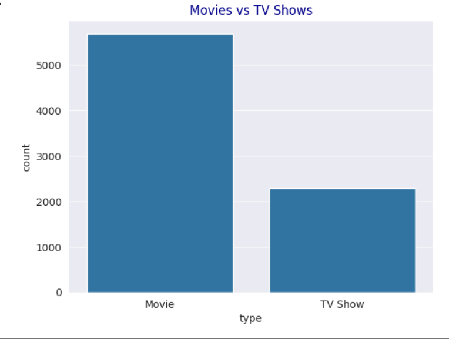
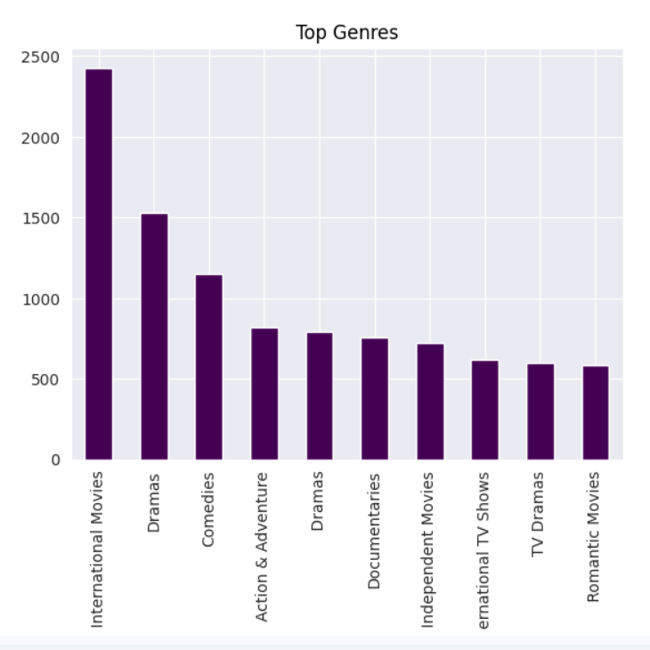
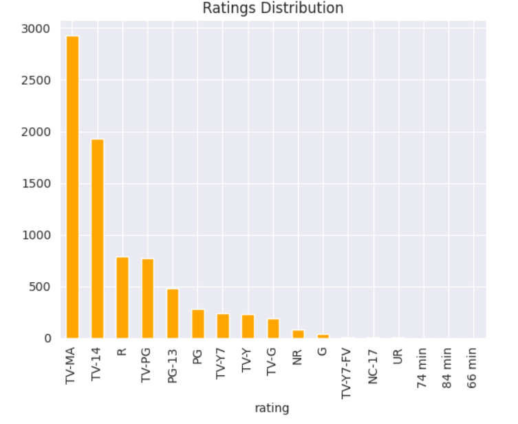

# Netflix-Data-Analysis
# 📊 Netflix Data Analysis

## 📌 Project Overview
This project analyzes Netflix dataset using Python.
## 📊 Visualizations

## 🛠 Tools Used
- Python
- Pandas
- Matplotlib
- Seaborn

## 📈 Insights
- Netflix has more Movies than TV Shows
- USA produces most content
- Content increased after 2015
- Most movies are 90–120 minutes

## 📂 Files
- netflix_analysis.ipynb

## 🙋‍♀️ Author
Khushbu Maurya
